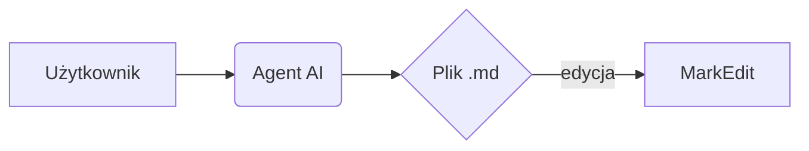

# Plan pracy agenta

To jest **akapit** z *kursywą*, `kodem`, [linkiem](https://example.com) i zmienną snake_case_name.
Wzór w linii: $E = mc^2$, a cena to $5 i $10.

## Zadania

- [x] Przeanalizować repozytorium
- [ ] Napisać testy
- [ ] Zaktualizować `CLAUDE.md`

1. Pierwszy krok
2. Drugi krok
   - zagnieżdżony punkt
   - kolejny

> Cytat: agent powinien pytać, gdy nie jest pewien.

| Plik | Status | Uwagi |
|------|:------:|-------|
| `app.js` | ✅ | gotowe |
| `main.swift` | 🚧 | w toku |

```python
def hello(name: str) -> str:
    return f"Cześć, {name}!"
```



$$
\int_0^1 x^2\,dx = \frac{1}{3}
$$

<!-- komentarz HTML niewidoczny w podglądzie -->

---

### Długa sekcja

Lorem ipsum dolor sit amet, consectetur adipiscing elit. Sed do eiusmod tempor incididunt ut labore et dolore magna aliqua. Ut enim ad minim veniam, quis nostrud exercitation ullamco laboris nisi ut aliquip ex ea commodo consequat.

Duis aute irure dolor in reprehenderit in voluptate velit esse cillum dolore eu fugiat nulla pariatur. Excepteur sint occaecat cupidatat non proident, sunt in culpa qui officia deserunt mollit anim id est laborum.

Ostatni akapit.
